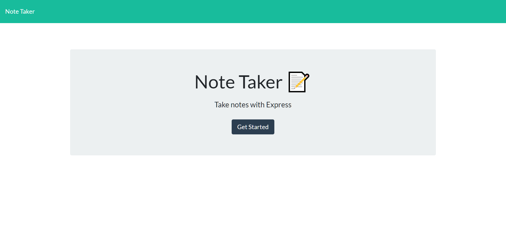

# Note Taker 

## Description

Note Taker is a project created to allow users to create and save notes on a server database via a simple front-end web application. It utilizes express.js to handle server creation and is deployed on heroku.

## Table of Contents

* [Installation](#installation)
* [Usage](#usage)
* [Contributing](#contributing)
* [License](#license)
* [Testing](#testing)
* [Questions](#questions)

## Installation

No installation required.

## Usage 

Simply navigate to https://immense-falls-72456.herokuapp.com/ then click get started. On the notes page, you can view previously saved notes by clicking on the note's title in the lefthand column, or write a new note by clicking the pencil icon in the upper-right corner of the page. After giving a new note a title and content, click the save button which will have appeared next to the pencil icon. To delete saved notes, click on the note's trash button.

## License

This project is covered under the following license(s):

ISC

## Contributing

Open a new issue to report bugs or request features.

## Testing

N/A

## Questions

GitHub Profile: [TRemigi](https://github.com/TRemigi)

Reach me via email at <tayremigi@gmail.com>

